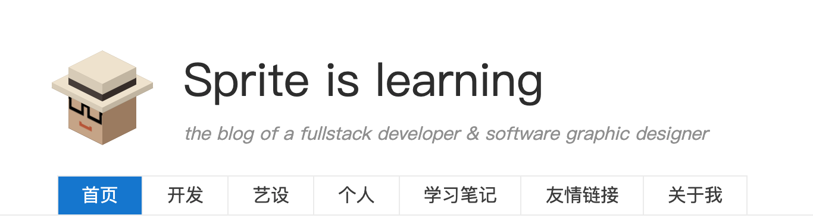

```
      ______      __        _____ ____
     / ____/_  __/ /_  ___ |__  // __ \
    / /   / / / / __ \/ _ \ /_ </ / / /
   / /___/ /_/ / /_/ /  __/__/ / /_/ /
   \____/\__,_/_.___/\___/____/_____/

    一个用于在HTML中添加伪3D元素的小插件（类似Minecraft风格）
    无需3D引擎、canvas画布或是OpenGL支持

```

[English](readme.md)  中文 

### 简介
本库主要是为了在HTML界面中增加轻量的趣味性伪3D内容而开发，无法实现三维空间模拟以及三维图形技术（诸如光照、纹理等等）

本库的功能是基于 CSS3的 3D变换而设计、其中每一个Cube(立方块)都是由6个div平面构成。
所以，你可以在这个div内以传统的HTML编辑方式进行更多的尝试。
效果如同下面这张截图(我的博客首页).



### 如何使用

#### 1. 在头部引入 cube3d.css

```html
<link rel="stylesheet" href="../dist/cube3d.css">
</head>
```
    
#### 2 引入vdom.core.js , cube3d.js
```html
</body>
<script src="../dist/vdom.core.js"></script>
<script src="../dist/cube3d.js"></script>
```

#### 3 创建Cube
```html
var cube = new C3dCube(120,120,120, [30,40,180,1] );
```

#### 4 将Cube添加到HTML中
```html
vdom('body').append( cube.container );
```

### 文档

#### C3dNode        : 空节点 （主要用于组合）
    - container     用于处理2D或文档关系的虚拟dom
    - cube          用于处理3D效果的虚拟dom
    
    - move
    - rotate
    - scale

#### C3dCube extends C3dNode : 拥有可见面的3d节点
    - Sides         各个面的数组
    - constract
    
    - top(),bottom(),left(),right(),front(),back()  快捷获取指定面 

#### C3dSide
    - vd
    - bg
    - d (direction id)
    - constract


### 示例

[demo](../demo/index.html)